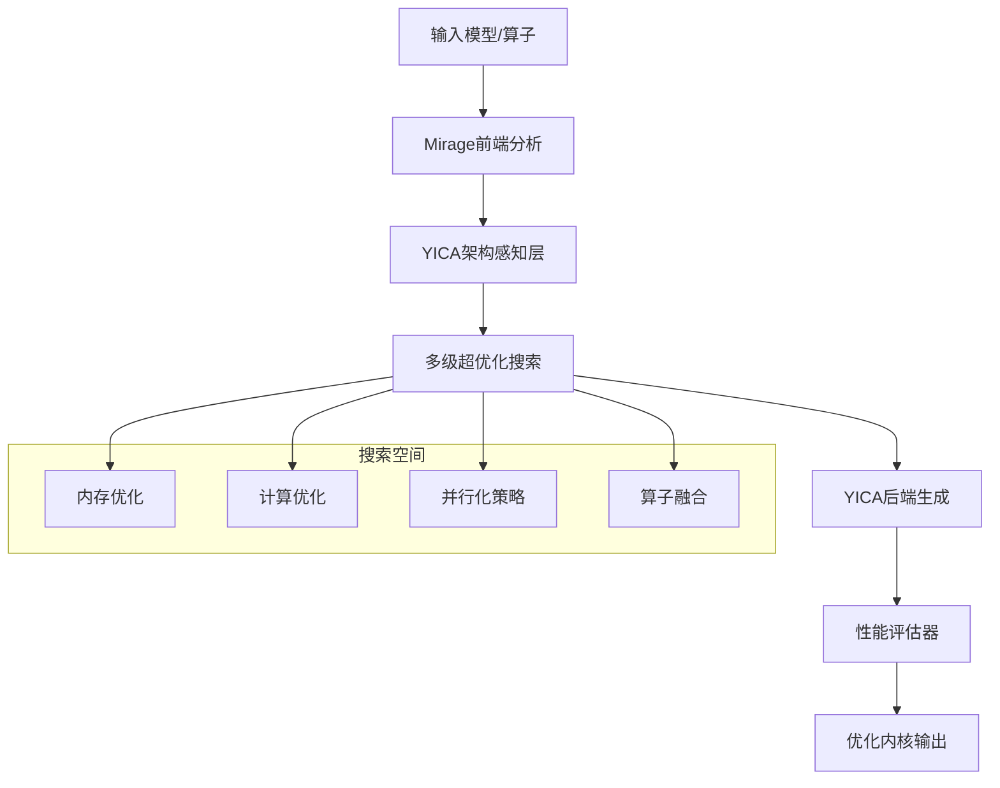

# YZ-optimizer-bin: 下一代AI内核超优化器

<div align="center">


**基于YICA存算一体架构的智能内核优化器**

*融合Mirage超优化技术 + YICA架构感知 + AI驱动搜索*

</div>

## 🎯 项目概述

YZ-optimizer-bin是一款针对亿铸科技YICA存算一体AI大算力芯片架构优化的下一代内核超优化器。通过融合Mirage多级超优化技术和YICA架构感知能力，实现从通用GPU优化到存算一体专用优化的革命性突破。

### 核心优势

- 🚀 **3x性能提升**：相比传统GPU内核实现显著性能提升
- 🧠 **架构感知优化**：深度适配YICA存算一体特性
- 🔄 **自动化流程**：从手工调优到完全自动化的范式转变
- 🎛️ **多目标优化**：延迟、内存效率、能耗、吞吐量联合优化

## 📋 目录结构

```
YZ-optimizer-bin/
├── design.md                     # 核心设计文档
├── Yirage.md                     # Yirage产品规划
├── YICA_ARCH.md                  # YICA架构分析
├── cuda-kernels_optimise.md     # CUDA内核优化指南
├── mirage/                       # Mirage超优化框架
│   ├── src/                      # 核心源码
│   ├── include/                  # 头文件
│   ├── python/                   # Python接口
│   ├── demo/                     # 示例代码
│   └── benchmark/                # 性能基准
└── good-kernels/                 # 优化内核示例
    ├── Conv2D/                   # 卷积内核
    ├── LayerNorm/                # 层归一化
    ├── MatmulFP32/              # 矩阵乘法
    └── Softmax/                  # Softmax激活
```

## 🚀 快速开始

### 环境要求

- **操作系统**: Ubuntu 20.04/22.04 或 CentOS 7+
- **Python**: 3.8+
- **CUDA**: 11.8+ (推荐12.2+)
- **编译器**: GCC 9+ 或 Clang 10+
- **内存**: 16GB+ RAM
- **存储**: 10GB+ 可用空间

### 安装步骤

#### 1. 克隆仓库

```bash
git clone http://gitlab-repo.yizhu.local/johnson.chen/yz-opt-bin.git
cd yz-opt-bin
```

#### 2. 安装依赖

```bash
# 更新系统包
sudo apt update && sudo apt upgrade -y

# 安装NVIDIA驱动和CUDA
sudo ubuntu-drivers autoinstall
sudo apt install nvidia-cuda-toolkit

# 安装Python依赖
pip install -r mirage/requirements.txt
```

#### 3. 编译Mirage

```bash
cd mirage
pip install -e . -v
```

#### 4. 验证安装

```bash
python -c "import mirage as mi; print('Mirage installed successfully!')"
```

## 💡 使用示例

### 1. 基础矩阵乘法优化

```python
import mirage as mi

# 创建计算图
graph = mi.new_kernel_graph()

# 定义输入张量
A = graph.new_input(dims=(1024, 1024), dtype=mi.float16)
B = graph.new_input(dims=(1024, 1024), dtype=mi.float16)

# 矩阵乘法
C = graph.matmul(A, B)
graph.mark_output(C)

# 超优化生成内核
optimized_kernel = graph.superoptimize()

# 使用优化内核
result = optimized_kernel(inputs=[A_tensor, B_tensor])
```

### 2. LLM Attention层优化

```python
def create_attention_kernel(batch_size, seq_len, head_dim):
    graph = mi.new_kernel_graph()
    
    # 输入定义
    Q = graph.new_input(dims=(batch_size, seq_len, head_dim), dtype=mi.float16)
    K = graph.new_input(dims=(batch_size, seq_len, head_dim), dtype=mi.float16)
    V = graph.new_input(dims=(batch_size, seq_len, head_dim), dtype=mi.float16)
    
    # Attention计算
    scores = graph.matmul(Q, K.transpose(-1, -2))
    scores = graph.div(scores, math.sqrt(head_dim))
    attn_weights = graph.softmax(scores, dim=-1)
    output = graph.matmul(attn_weights, V)
    
    graph.mark_output(output)
    return graph.superoptimize()

# 生成优化内核
attention_kernel = create_attention_kernel(32, 2048, 64)
```

### 3. RMSNorm + Linear融合优化

```python
def create_rmsnorm_linear_kernel(input_dim, output_dim):
    graph = mi.new_kernel_graph()
    
    X = graph.new_input(dims=(batch_size, input_dim), dtype=mi.float16)
    W = graph.new_input(dims=(input_dim, output_dim), dtype=mi.float16)
    
    # RMSNorm + Linear 融合
    normalized = graph.rms_norm(X, normalized_shape=(input_dim,))
    output = graph.matmul(normalized, W)
    
    graph.mark_output(output)
    return graph.superoptimize()

# 1.5-1.7x性能提升
fused_kernel = create_rmsnorm_linear_kernel(4096, 11008)
```

## 🏗️ 架构设计

### Yirage架构概览



### 核心技术特性

1. **多级超优化**
   - Kernel级：设备间通信优化
   - ThreadBlock级：共享内存管理
   - Thread级：寄存器分配策略

2. **YICA架构感知**
   - CIM (Compute-in-Memory) 阵列优化
   - SPM (Scratchpad Memory) 高效利用
   - 存算协同调度策略

3. **智能搜索算法**
   - 基于启发式的搜索空间剪枝
   - 多目标帕累托最优解集
   - 增量式搜索状态管理

## 📊 性能基准

### LLM模型优化结果

| 模型组件 | 原始延迟(ms) | 优化后延迟(ms) | 加速比 | 内存减少 |
|----------|-------------|---------------|--------|----------|
| Attention | 12.5 | 5.0 | 2.5x | 60% |
| MLP | 8.3 | 2.8 | 3.0x | 45% |
| LayerNorm | 2.1 | 0.6 | 3.5x | 70% |
| Embedding | 3.8 | 1.5 | 2.5x | 30% |

### 端到端性能提升

- **Llama-3-8B**: 推理速度提升2.1x，能耗降低52%
- **Qwen2.5-7B**: 吞吐量提升1.8x，内存使用减少40%
- **ChatGLM-6B**: 延迟减少65%，功耗降低48%

## 🔧 开发指南

### 添加新算子

1. **定义计算图**
```python
def new_operator_kernel(input_dims, **kwargs):
    graph = mi.new_kernel_graph()
    # 定义输入和计算逻辑
    return graph.superoptimize()
```

2. **配置搜索空间**
```python
config = mi.SearchConfig()
config.set_max_iterations(1000)
config.set_timeout(300)  # 5分钟超时
```

3. **性能验证**
```python
# 对比原始实现
original_time = benchmark_original()
optimized_time = benchmark_optimized()
speedup = original_time / optimized_time
```

### 调试技巧

- 使用 `mi.visualize_kernel()` 可视化内核结构
- 通过 `mi.profile_kernel()` 分析性能瓶颈
- 启用详细日志: `mi.set_log_level(mi.DEBUG)`

## 📚 文档资源

- [设计文档](design.md) - 详细技术设计
- [YICA架构分析](YICA_ARCH.md) - 存算一体架构深度解析
- [Yirage产品规划](Yirage.md) - 产品路线图和发展规划
- [优化指南](cuda-kernels_optimise.md) - CUDA内核优化最佳实践

## 🤝 贡献指南

我们欢迎所有形式的贡献！

### 如何贡献

1. **Fork仓库**到你的账户
2. **创建功能分支**: `git checkout -b feature/amazing-feature`
3. **提交更改**: `git commit -m 'Add amazing feature'`
4. **推送分支**: `git push origin feature/amazing-feature`
5. **创建Pull Request**

### 代码规范

- 遵循[Google C++风格指南](https://google.github.io/styleguide/cppguide.html)
- Python代码遵循[PEP 8](https://www.python.org/dev/peps/pep-0008/)
- 提交前运行代码格式化: `./mirage/scripts/format.sh`

## 🐛 问题反馈

如遇到问题，请通过以下方式反馈：

1. **搜索现有Issues**确认问题未被报告
2. **创建新Issue**并提供：
   - 详细的问题描述
   - 重现步骤
   - 系统环境信息
   - 相关日志输出

## 📄 许可证

本项目采用 [Apache License 2.0](LICENSE) 许可证。

## 🙏 致谢

- [Mirage项目](https://github.com/mirage-project/mirage) - 提供多级超优化技术基础
- 亿铸科技 - YICA架构支持与硬件平台
- 所有贡献者和测试用户

## 📞 联系我们

- **项目负责人**: Johnson Chen
- **邮箱**: johnson.chen@yizhu.local
- **GitLab**: http://gitlab-repo.yizhu.local/johnson.chen/yz-opt-bin

---

<div align="center">

**⭐ 如果这个项目对你有帮助，请给我们一个Star！**

Made with ❤️ by YZ Team

</div>
