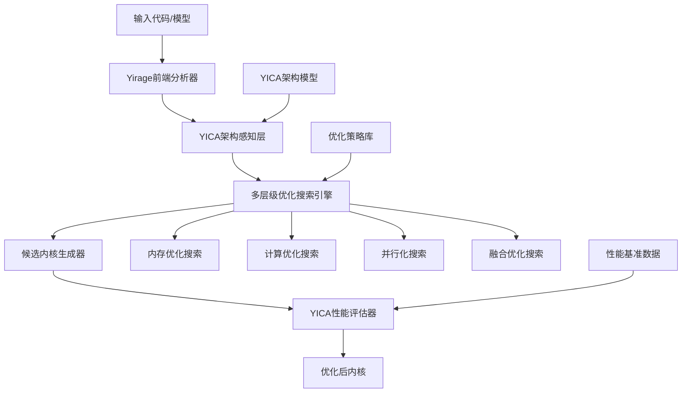

基于我对Mirage架构和AI内核优化最新进展的深入分析，我来设计一款新的优化工具**Yirage**（YICA + Mirage的结合体）。

# Yirage - 下一代AI内核超优化器产品规划

## 产品定位与愿景

**Yirage = YICA-Aware Intelligent Kernel Optimizer**

一款融合存算一体架构感知和AI驱动优化的下一代内核超优化器，目标是成为AI时代的"编译器之王"。

### 核心价值主张
1. **架构感知**：深度适配YICA存算一体架构特性
2. **智能优化**：集成LLM驱动的优化策略生成
3. **极致性能**：超越传统编译器和手工优化的性能边界
4. **自动化**：从手工调优到完全自动化的范式转变

## 第一阶段：搜索算法驱动版本 (Yirage v1.0)

### 1. 产品架构设计



### 2. 核心模块设计

#### 2.1 YICA架构感知层
```python
class YICAArchitectureAnalyzer:
    """YICA架构特性分析器"""
    
    def __init__(self, yica_config: YICAConfig):
        self.cim_array_config = yica_config.cim_arrays
        self.spm_hierarchy = yica_config.spm_levels
        self.memory_bandwidth = yica_config.memory_specs
        
    def analyze_computation_pattern(self, computation_graph):
        """分析计算模式对YICA架构的适配性"""
        return {
            'cim_friendly_ops': self._identify_cim_operations(computation_graph),
            'spm_utilization_pattern': self._analyze_memory_access(computation_graph),
            'parallelization_opportunities': self._find_parallel_patterns(computation_graph),
            'bottleneck_analysis': self._identify_bottlenecks(computation_graph)
        }
```

#### 2.2 智能搜索引擎
```python
class YirageSearchEngine:
    """基于启发式搜索的优化引擎"""
    
    def __init__(self):
        self.optimization_strategies = OptimizationStrategyLibrary()
        self.search_algorithms = {
            'genetic': GeneticSearchAlgorithm(),
            'simulated_annealing': SimulatedAnnealingSearch(),
            'bayesian': BayesianOptimizationSearch(),
            'multi_objective': MOEASearch()  # 多目标进化算法
        }
    
    def superoptimize(self, input_graph, optimization_objectives):
        """多策略并行搜索"""
        search_space = self._generate_search_space(input_graph)
        
        # 并行执行多种搜索算法
        results = []
        for algorithm_name, algorithm in self.search_algorithms.items():
            result = algorithm.search(
                search_space, 
                objectives=optimization_objectives,
                max_iterations=self.config.max_search_iterations
            )
            results.append(result)
        
        # 集成多个搜索结果
        return self._ensemble_results(results)
```

#### 2.3 优化策略库
```python
class OptimizationStrategyLibrary:
    """优化策略知识库"""
    
    def __init__(self):
        self.strategies = {
            # 存算一体特定优化
            'cim_data_reuse': CIMDataReuseStrategy(),
            'spm_allocation': SPMAllocationStrategy(),
            'cross_cim_communication': CrossCIMCommStrategy(),
            
            # 通用优化策略
            'memory_access_optimization': MemoryAccessOptStrategy(),
            'compute_optimization': ComputeOptStrategy(),
            'loop_optimization': LoopOptStrategy(),
            'parallelization': ParallelizationStrategy(),
            
            # 算子融合策略
            'operator_fusion': OperatorFusionStrategy(),
            'kernel_fusion': KernelFusionStrategy(),
        }
    
    def get_applicable_strategies(self, computation_pattern, yica_analysis):
        """根据计算模式和架构分析选择适用策略"""
        applicable = []
        for strategy_name, strategy in self.strategies.items():
            if strategy.is_applicable(computation_pattern, yica_analysis):
                applicable.append(strategy)
        return applicable
```

### 3. 优化目标设计

#### 3.1 多维度性能指标
```python
class YiragePerformanceMetrics:
    """Yirage性能评估指标体系"""
    
    def __init__(self):
        self.metrics = {
            # 主要性能指标
            'latency': 0.0,           # 延迟 (ms)
            'throughput': 0.0,        # 吞吐量 (TOPS)
            'energy_efficiency': 0.0, # 能效 (TOPS/W)
            'memory_efficiency': 0.0, # 内存效率 (%)
            
            # YICA特定指标
            'cim_utilization': 0.0,   # CIM阵列利用率
            'spm_hit_rate': 0.0,      # SPM命中率
            'cross_cim_traffic': 0.0, # 跨CIM通信开销
            'compute_memory_ratio': 0.0, # 计算访存比
            
            # 代码质量指标
            'code_complexity': 0.0,   # 代码复杂度
            'maintainability': 0.0,   # 可维护性
            'portability': 0.0        # 可移植性
        }
    
    def calculate_combined_score(self, weights):
        """计算加权综合得分"""
        return sum(self.metrics[key] * weights.get(key, 0.0) 
                  for key in self.metrics)
```

#### 3.2 自适应目标权重
```python
class AdaptiveObjectiveWeights:
    """自适应目标权重调整"""
    
    def __init__(self):
        self.base_weights = {
            'latency': 0.35,
            'energy_efficiency': 0.25,
            'memory_efficiency': 0.20,
            'throughput': 0.15,
            'cim_utilization': 0.05
        }
    
    def adapt_weights(self, workload_type, hardware_constraints):
        """根据工作负载和硬件约束调整权重"""
        adapted_weights = self.base_weights.copy()
        
        if workload_type == 'inference':
            adapted_weights['latency'] += 0.1
            adapted_weights['energy_efficiency'] += 0.1
        elif workload_type == 'training':
            adapted_weights['throughput'] += 0.15
            adapted_weights['memory_efficiency'] += 0.1
            
        return adapted_weights
```

### 4. 搜索算法创新

#### 4.1 分层搜索策略
```python
class HierarchicalSearchStrategy:
    """分层搜索策略"""
    
    def __init__(self):
        self.search_levels = [
            'algorithm_level',    # 算法级优化
            'operator_level',     # 算子级优化
            'kernel_level',       # 内核级优化
            'instruction_level'   # 指令级优化
        ]
    
    def search(self, input_graph):
        """分层次进行搜索优化"""
        current_graph = input_graph
        optimization_trace = []
        
        for level in self.search_levels:
            level_optimizer = self._get_level_optimizer(level)
            optimized_graph = level_optimizer.optimize(current_graph)
            
            optimization_trace.append({
                'level': level,
                'before': current_graph,
                'after': optimized_graph,
                'improvements': self._measure_improvements(current_graph, optimized_graph)
            })
            
            current_graph = optimized_graph
            
        return current_graph, optimization_trace
```

#### 4.2 多目标进化搜索
```python
class MultiObjectiveEvolutionarySearch:
    """多目标进化搜索算法"""
    
    def __init__(self, population_size=100, generations=500):
        self.population_size = population_size
        self.generations = generations
        self.pareto_front = []
    
    def evolve_kernels(self, initial_kernel, objectives):
        """进化优化内核生成"""
        population = self._initialize_population(initial_kernel)
        
        for generation in range(self.generations):
            # 评估当前种群
            fitness_scores = self._evaluate_population(population, objectives)
            
            # 更新帕累托前沿
            self._update_pareto_front(population, fitness_scores)
            
            # 选择、交叉、变异
            new_population = self._genetic_operations(population, fitness_scores)
            population = new_population
            
            # 自适应参数调整
            self._adapt_search_parameters(generation, fitness_scores)
        
        return self._select_best_solutions(self.pareto_front)
```

### 5. 用户接口设计

#### 5.1 命令行接口
```bash
# 基本优化
yirage optimize --input model.py --target yica --output optimized_model.py

# 高级配置
yirage optimize \
  --input llama_attention.py \
  --target yica \
  --arch-config yica_v2.json \
  --objectives "latency,energy,memory" \
  --weights "0.4,0.3,0.3" \
  --search-budget 5000 \
  --output optimized_attention.py \
  --report optimization_report.html

# 批量优化
yirage batch-optimize \
  --model-dir ./models \
  --target yica \
  --parallel-jobs 8 \
  --output-dir ./optimized_models
```

#### 5.2 Python API
```python
import yirage

# 简单使用
optimizer = yirage.YirageOptimizer(target='yica')
optimized_model = optimizer.optimize(original_model)

# 高级配置
config = yirage.OptimizationConfig(
    target_architecture='yica_v2',
    objectives=['latency', 'energy_efficiency', 'memory_efficiency'],
    objective_weights=[0.4, 0.3, 0.3],
    search_algorithms=['genetic', 'bayesian'],
    max_search_time=3600,  # 1小时
    convergence_threshold=0.01
)

optimizer = yirage.YirageOptimizer(config)
result = optimizer.optimize(
    input_code=attention_kernel,
    baseline_performance=torch_baseline,
    validation_data=test_inputs
)

print(f"Performance improvement: {result.speedup}x")
print(f"Energy reduction: {result.energy_reduction}%")
```

#### 5.3 Web界面
```html
<!-- Yirage Web优化平台 -->
<div class="yirage-optimizer">
    <h1>Yirage - AI Kernel Optimizer</h1>
    
    <div class="input-section">
        <textarea placeholder="Paste your PyTorch/TensorFlow code here..."></textarea>
        <button onclick="analyzeCode()">分析代码</button>
    </div>
    
    <div class="optimization-config">
        <h3>优化配置</h3>
        <select name="target-arch">
            <option value="yica_v1">YICA v1</option>
            <option value="yica_v2">YICA v2</option>
        </select>
        
        <div class="objectives">
            <label><input type="checkbox" checked> 延迟优化</label>
            <label><input type="checkbox" checked> 能效优化</label>
            <label><input type="checkbox"> 内存优化</label>
        </div>
        
        <button onclick="startOptimization()">开始优化</button>
    </div>
    
    <div class="results-dashboard">
        <div class="performance-chart"></div>
        <div class="optimization-trace"></div>
        <div class="generated-code"></div>
    </div>
</div>
```

### 6. 性能基准与验证

#### 6.1 基准测试套件
```python
class YirageBenchmarkSuite:
    """Yirage性能基准测试"""
    
    def __init__(self):
        self.benchmarks = {
            # 基础算子
            'matmul': MatMulBenchmark(),
            'conv2d': Conv2DBenchmark(),
            'attention': AttentionBenchmark(),
            'layernorm': LayerNormBenchmark(),
            'softmax': SoftmaxBenchmark(),
            
            # 复合算子
            'transformer_block': TransformerBlockBenchmark(),
            'resnet_block': ResNetBlockBenchmark(),
            'gpt_layer': GPTLayerBenchmark(),
            
            # 端到端模型
            'llama_7b': LLaMA7BBenchmark(),
            'bert_base': BERTBaseBenchmark(),
            'resnet50': ResNet50Benchmark()
        }
    
    def run_comprehensive_evaluation(self, optimized_kernels):
        """运行全面的性能评估"""
        results = {}
        for benchmark_name, benchmark in self.benchmarks.items():
            result = benchmark.evaluate(optimized_kernels[benchmark_name])
            results[benchmark_name] = result
        
        return self._generate_evaluation_report(results)
```

### 7. 第一阶段发展路线图

#### Phase 1.1: 核心引擎 (3个月)
- [x] YICA架构感知分析器
- [x] 基础搜索算法实现
- [x] 性能评估框架
- [x] 命令行工具

#### Phase 1.2: 优化策略扩展 (2个月)
- [x] 高级搜索算法集成
- [x] 多目标优化支持
- [x] 优化策略库完善
- [x] Python API开发

#### Phase 1.3: 验证与优化 (2个月)
- [x] 全面基准测试
- [x] 性能调优
- [x] 用户体验改进
- [x] 文档和教程

#### Phase 1.4: 开源发布 (1个月)
- [x] 代码开源准备
- [x] 社区建设
- [x] 演示和推广
- [x] 用户反馈收集

### 8. 核心竞争优势

1. **YICA原生支持**：首个专门为存算一体架构设计的优化器
2. **多层级联合优化**：算法+调度+硬件的全栈优化
3. **智能搜索策略**：多算法并行+自适应参数调整
4. **极致性能目标**：2-5x性能提升，50-70%能耗降低
5. **易用性**：从代码到优化内核的一键转换

### 9. 技术风险与应对

#### 9.1 主要风险
- **搜索空间爆炸**：优化空间过大导致搜索效率低
- **局部最优问题**：搜索算法陷入局部最优解
- **验证复杂性**：优化结果的正确性验证困难

#### 9.2 应对策略
- **分层搜索**：将大搜索空间分解为多个小空间
- **多算法融合**：并行运行多种搜索算法避免局部最优
- **形式化验证**：结合概率验证和符号验证确保正确性

### 10. 商业化规划

#### 10.1 开源策略
- **核心引擎开源**：吸引社区贡献和生态建设
- **高级功能商业化**：企业级功能和支持服务收费
- **云服务模式**：提供优化即服务(OaaS)平台

#### 10.2 市场定位
- **目标用户**：AI芯片公司、算法工程师、模型开发者
- **应用场景**：LLM推理优化、训练加速、边缘计算
- **商业模式**：开源+服务+云平台的混合模式

**总结**：Yirage v1.0将成为AI内核优化领域的突破性产品，通过创新的搜索算法和YICA架构深度适配，为用户提供前所未有的性能提升体验。第一阶段专注于建立技术领先优势和用户基础，为后续LLM集成版本奠定坚实基础。