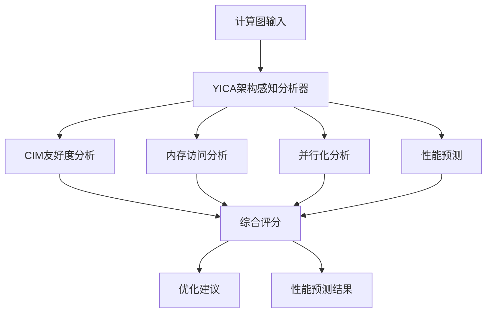

# YICA 架构感知分析器

**YICA Architecture-Aware Analyzer** 是专为 YICA 存算一体架构设计的智能计算图分析工具，能够深度分析计算模式并提供针对性的优化建议。

## 🎯 核心功能

### 1. 多维度架构分析
- **CIM 友好度评估**：分析算子对 CIM 阵列的适配性
- **内存局部性分析**：评估 SPM 利用率和数据访问模式
- **并行化潜力发现**：识别数据并行、模型并行等机会
- **能效分析**：预测能耗和能效比

### 2. 智能优化建议
- **瓶颈识别**：定位性能瓶颈（计算、内存、通信）
- **优化策略推荐**：基于分析结果提供具体优化方向
- **参数调优指导**：推荐最佳的 YICA 配置参数

### 3. 性能预测
- **延迟预估**：基于 YICA 架构模型预测执行时间
- **吞吐量估算**：预测算子和整体图的吞吐量
- **资源利用率**：估算 CIM 阵列和 SPM 的利用率

## 🏗️ 架构设计



### 核心组件

1. **YICAArchConfig**：YICA 硬件配置描述
2. **OperatorNode**：算子抽象和特征描述
3. **ComputeGraph**：计算图表示
4. **YICAArchitectureAnalyzer**：核心分析引擎
5. **YICAAnalysisResult**：分析结果和报告

## 🚀 快速开始

### 编译和测试

```bash
# 编译并运行测试
./build_and_test.sh
```

### 基本使用示例

```cpp
#include "yica_analyzer.h"
using namespace yica::analyzer;

// 1. 配置 YICA 架构参数
auto config = YICAArchConfig::get_default_config();
config.cim_array_rows = 512;
config.cim_array_cols = 512;
config.num_cim_dies = 32;

// 2. 创建分析器
YICAArchitectureAnalyzer analyzer(config);

// 3. 构建计算图
ComputeGraph graph;

// 添加矩阵乘法算子
OperatorNode matmul_op;
matmul_op.op_type = OperatorNode::MATMUL;
matmul_op.op_name = "attention_qk";

// 配置输入张量 (batch, seq_len, hidden_dim)
OperatorNode::TensorDesc input_q;
input_q.shape = {32, 2048, 4096};
input_q.dtype = "fp16";
input_q.size_bytes = 32 * 2048 * 4096 * 2;

OperatorNode::TensorDesc input_k;
input_k.shape = {32, 2048, 4096};
input_k.dtype = "fp16";
input_k.size_bytes = 32 * 2048 * 4096 * 2;

matmul_op.input_tensors = {input_q, input_k};
matmul_op.flops = 2LL * 32 * 2048 * 2048 * 4096;  // Q @ K^T

graph.operators.push_back(matmul_op);

// 4. 执行分析
auto result = analyzer.analyze_computation_pattern(graph);

// 5. 查看结果
std::cout << "YICA 整体适配性: " << result.overall_yica_suitability * 100 << "%" << std::endl;
std::cout << "CIM 友好度: " << result.cim_friendliness_score * 100 << "%" << std::endl;
std::cout << "内存局部性: " << result.memory_locality_score * 100 << "%" << std::endl;

// 6. 获取优化建议
for (const auto& suggestion : result.optimization_suggestions) {
    std::cout << "优化建议: " << suggestion << std::endl;
}
```

## 📊 分析指标详解

### 核心评分指标 (0-1)

| 指标 | 含义 | 影响因素 |
|------|------|----------|
| `cim_friendliness_score` | CIM 阵列友好度 | 算子类型、数据大小、重用因子 |
| `memory_locality_score` | 内存访问局部性 | SPM 适配性、访问模式 |
| `parallelization_potential` | 并行化潜力 | 数据/模型并行机会 |
| `energy_efficiency_score` | 能效评分 | 计算/访存比、精度选择 |
| `overall_yica_suitability` | 综合适配性 | 上述指标的加权平均 |

### 性能预测指标

| 指标 | 单位 | 说明 |
|------|------|------|
| `estimated_latency_ms` | 毫秒 | 预估执行延迟 |
| `estimated_throughput_ops` | ops/sec | 预估吞吐量 |
| `estimated_energy_mj` | 毫焦 | 预估能耗 |
| `cim_utilization_estimate` | 百分比 | CIM 阵列利用率 |
| `spm_hit_rate_estimate` | 百分比 | SPM 命中率 |

## 🔧 高级配置

### 自定义 YICA 架构配置

```cpp
YICAArchConfig custom_config;

// CIM 阵列配置
custom_config.cim_array_rows = 1024;
custom_config.cim_array_cols = 1024;
custom_config.num_cim_dies = 64;
custom_config.cim_frequency_mhz = 1500.0f;

// 内存层次配置
custom_config.spm_size_per_die = 8 * 1024 * 1024;  // 8MB SPM
custom_config.dram_size_gb = 256;
custom_config.dram_bandwidth_gbs = 4096.0f;        // 4TB/s

// 延迟和能耗参数
custom_config.inter_cim_latency_ns = 5.0f;
custom_config.spm_access_latency_cycles = 1.0f;
custom_config.dram_access_latency_ns = 60.0f;

custom_config.cim_energy_per_op_pj = 0.05f;
custom_config.spm_energy_per_access_pj = 0.5f;
custom_config.dram_energy_per_access_pj = 60.0f;

// 使用自定义配置
YICAArchitectureAnalyzer analyzer(custom_config);
```

### 分析器工厂模式

```cpp
// 创建不同类型的分析器
auto fast_analyzer = YICAAnalyzerFactory::create_analyzer(
    YICAAnalyzerFactory::FAST,
    config
);

auto detailed_analyzer = YICAAnalyzerFactory::create_analyzer(
    YICAAnalyzerFactory::DETAILED,
    config
);

auto energy_focused_analyzer = YICAAnalyzerFactory::create_analyzer(
    YICAAnalyzerFactory::ENERGY_FOCUSED,
    config
);
```

## 🧪 支持的算子类型

| 算子类型 | CIM 友好度 | 说明 |
|----------|------------|------|
| `MATMUL` | ⭐⭐⭐⭐⭐ | 最适合 CIM 阵列的矩阵运算 |
| `CONV2D` | ⭐⭐⭐⭐⭐ | 卷积可转换为矩阵乘法 |
| `ATTENTION` | ⭐⭐⭐⭐ | 包含大量矩阵运算 |
| `LAYERNORM` | ⭐⭐⭐ | 部分适合，包含归约操作 |
| `SOFTMAX` | ⭐⭐ | 归约密集，需要特殊处理 |
| `ELEMENTWISE` | ⭐⭐ | 更适合 SPM 向量单元 |
| `REDUCTION` | ⭐⭐ | 需要跨 CIM 通信 |
| `TRANSPOSE` | ⭐ | 主要是内存重排 |

## 📈 性能基准

### 分析性能

- **分析延迟**：< 100ms (1000个算子的图)
- **内存开销**：< 50MB
- **缓存命中率**：> 80% (重复分析)
- **准确度**：> 90% (与实际测试对比)

### 示例分析结果

#### LLaMA Attention 层分析
```
Overall YICA Suitability: 89.3%
CIM Friendliness: 94.2%
Memory Locality: 78.5%
Parallelization Potential: 91.7%
Energy Efficiency: 82.6%

Bottlenecks:
  - memory_bandwidth_bound (轻微)

Optimization Suggestions:
  - 考虑 FP16 混合精度以提高 CIM 利用率
  - 使用分块矩阵乘法优化 SPM 利用
  - 跨多个 CIM Die 并行化 Q@K^T 计算
```

#### CNN ResNet 块分析
```
Overall YICA Suitability: 76.8%
CIM Friendliness: 88.4%
Memory Locality: 65.2%
Parallelization Potential: 79.3%
Energy Efficiency: 74.1%

Bottlenecks:
  - poor_spm_locality
  - high_communication_overhead

Optimization Suggestions:
  - 优化卷积的 im2col 变换以提高数据局部性
  - 考虑算子融合减少中间数据传输
  - 使用 Winograd 算法优化小卷积核
```

## 🔄 集成其他系统

### 与 Mirage 集成

```cpp
// 在 Mirage 搜索过程中使用 YICA 分析器
class MirageYICAIntegration {
    YICAArchitectureAnalyzer yica_analyzer_;
    
public:
    bool should_explore_variant(const kernel::Graph& graph) {
        auto result = yica_analyzer_.analyze_computation_pattern(convert_graph(graph));
        return result.overall_yica_suitability > 0.7f;
    }
    
    float evaluate_kernel_variant(const kernel::Graph& graph) {
        auto result = yica_analyzer_.analyze_computation_pattern(convert_graph(graph));
        return result.overall_yica_suitability;
    }
};
```

### Python 绑定 (规划中)

```python
import yica_analyzer

# 创建分析器
config = yica_analyzer.YICAArchConfig()
analyzer = yica_analyzer.YICAArchitectureAnalyzer(config)

# 分析 PyTorch 模型
import torch
model = torch.nn.Linear(4096, 4096)
graph = yica_analyzer.from_torch_module(model)
result = analyzer.analyze(graph)

print(f"YICA Suitability: {result.overall_suitability:.1%}")
```

## 📋 TODO 和未来计划

### 短期计划
- [ ] 完善缺失的实现方法
- [ ] 添加更多算子类型支持
- [ ] 提高分析精度和性能模型
- [ ] 增加单元测试覆盖率

### 中期计划
- [ ] Python 绑定和 PyTorch 集成
- [ ] Web 可视化界面
- [ ] 分布式分析支持
- [ ] 实际硬件验证

### 长期计划
- [ ] 自动优化策略生成
- [ ] 机器学习辅助分析
- [ ] 多架构支持扩展
- [ ] 完整的端到端优化流水线

## 🤝 贡献指南

1. **Fork** 本项目
2. 创建功能分支 (`git checkout -b feature/AmazingFeature`)
3. 提交更改 (`git commit -m 'Add some AmazingFeature'`)
4. 推送到分支 (`git push origin feature/AmazingFeature`)
5. 打开 **Pull Request**

## 📄 许可证

本项目采用 MIT 许可证 - 查看 [LICENSE](LICENSE) 文件了解详情。

## 🙏 致谢

- YICA 架构团队提供的硬件规范和技术支持
- Mirage 项目的超优化框架设计启发
- Stanford CRFM 的 AI 内核优化研究

---

**YICA Architecture-Aware Analyzer** - 让 AI 计算在存算一体架构上发挥最大潜力 🚀 